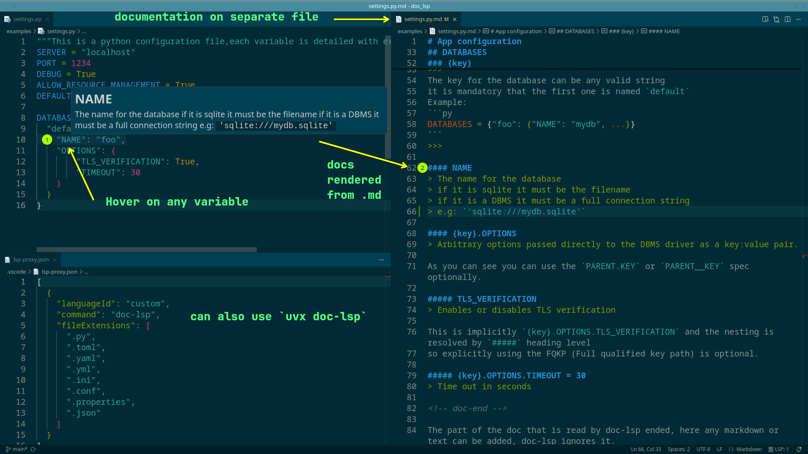

# doc-lsp

[](https://github.com/rochacbruno/doc_lsp/actions/workflows/test.yml)
[](https://codecov.io/gh/rochacbruno/doc_lsp)
[](https://www.python.org/downloads/)
[](https://github.com/rochacbruno/doc_lsp/blob/main/LICENSE)

doc-lsp is a simple specification and LSP (Language Server) that loads comments from a separate file.

Document variables in a separate markdown file and this LSP will show the docs on your editor.

Works on:

- Python
- YAML
- JSON
- TOML
- INI
- Properties
- Conf
- .env files
- and more...



## Standard

Assuming a file named `settings.py` 

```py
SERVER = "localhost"
PORT = 4545
```

Or a `config.conf`

```conf
max_open_windows    true
font_size           18
```

Then the LSP will lookup information about each variable on a separate file.

`settings.py.md`
```markdown
## SERVER
> This variable defines which server the system is connected to,         
> when used together with port this will define the connection string.   
> example: `hostname:port`                                             

## PORT
> Port used to connect ot server

```

`config.conf.md`
```markdown
## max_open_windows
> This variable is used to set how many multiple tiles can be opened
> at the same time.

## font_size = 18
> Set the default size for the system font.
```

## Usage

With the LSP Server `doc-lsp` enabled on your editor,
having the variable selected or with cursor focus, trigger the action `view_doc` 
and the editor will show the overlay with the full text from the respective comment file.

`|` = mouse cursor position
```py
SERV|ER = "foo"
```

Hovering the mouse over the variable will show the documentation.

```plain
SERV|ER = "foo"
    _________________________________________________________________________
    | SERVER                                                                  |
    | This variable defines which server the system is connected to,         |
    | when used together with port this will define the connection string.   |
    | example: `hostname:port`                                               |
    _________________________________________________________________________
```

If the `settings.py.md` does not exist, then the action will be NOOP and just emit a INFO `Doc not found for variable`.


## Installation

### Install the Language Server

```bash
# Using pip
pip install doc-lsp

# Using uv
uv tool install doc-lsp

# From source
git clone https://github.com/rochacbruno/doc_lsp.git
cd doc_lsp
uv pip install -e .
```

### Editor Integration

#### VS Code Extension

The easiest way to use doc-lsp in VS Code is with the official extension:

1. **Build and install the extension**:
   ```bash
   cd code/doc-lsp-vscode
   npm install
   npm run package
   code --install-extension doc-lsp-*.vsix
   ```

2. **Configure** (optional):
   ```json
   {
     "docLsp.enabled": true,
     "docLsp.serverPath": "doc-lsp",
     "docLsp.additionalFileExtensions": [".cfg", ".env"]
   }
   ```

See [code/doc-lsp-vscode/README.md](code/doc-lsp-vscode/README.md) for detailed instructions.

#### Generic LSP Proxy (Alternative for VS Code)

You can also use the [Generic LSP Proxy](https://marketplace.visualstudio.com/items?itemName=statiolake.vscode-generic-lsp-proxy) extension:

1. Install the extension
2. Create `.vscode/lsp-proxy.json` in your workspace (see example in `.vscode/lsp-proxy.json`)
3. Reload VS Code

#### Other Editors

doc-lsp implements the Language Server Protocol and can be used with any LSP-compatible editor:

- **Neovim**: Use [nvim-lspconfig](https://github.com/neovim/nvim-lspconfig)
- **Emacs**: Use [lsp-mode](https://emacs-lsp.github.io/lsp-mode/)
- **Sublime Text**: Use [LSP](https://github.com/sublimelsp/LSP)

## Implementation

- The doc-lsp is implemented in Python
- It is designed to run from `uv`
- It will cache the documentation for each variable, so if the file is not changed, the documentation will be read from the cache, it can use `workspace/didChangeWatchedFiles` to invalidate the cache.

## Specs

- doc-lsp is filetype agnostic
- doc-lsp lookup will match `filename.ext` -> `filename.ext.md`
- Lookup is made from the doc-lsp parser
- The last occurence wins in case of duplication

 
See [./examples](examples) 


